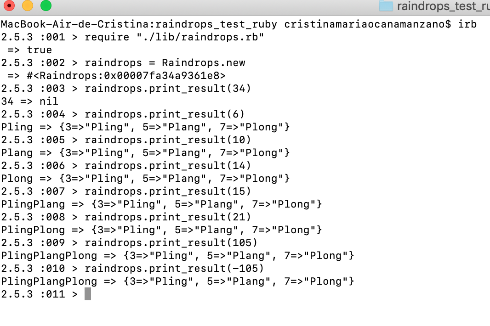
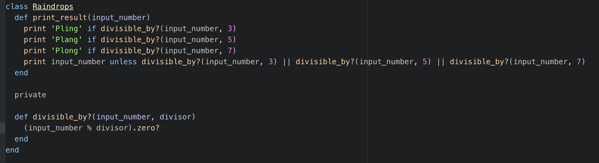

Raindrops Tech Test in Ruby
==================
This is my proposed solution for the Raindrops tech test in Ruby.

What is the program about?
-------
This is a program where the user can input a number and, depending on the number, the output will differ:
- If the number is divisible by 3, the output will be 'Pling'
- If the number is divisible by 5, the output will be 'Plang'
- If the number is divisible by 7, the output will be 'Plong'
- If the number is not divisible by any of the numbers mentioned above, the output will be the same number

Technologies used
-------
- Ruby
- RSpec for testing
- Simplecov for test coverage
- Rubocop as a linter

Setup
-------
1. Download this repository and navigate to it in the command line
2. Run 'bundle' to install the gems

How to run the tests
-------
1. Navigate to this repository in the command line
2. Run 'rspec'

How to use it
-------
1. Navigate to this repository in the command line
2. Run 'irb'
3. Require the file ('require "./lib/raindrops.rb"')
4. Create an instance of the class ('Raindrops.new')
5. Use the method "print_result" with your desired input number

Approach to solve this tech test
------

Before reaching the final solution, the code implemented at the beginning was the following:

This solution was short and readable and it would be ok if we were sure that this program would never be changed. However, it does not make it easy to change or extend the program later in the future. For example, if we were asked to add 10 new rules, we would need to add 10 more lines with if-statements and ten more options to the unless-statement.

Bearing this in mind, the *final solution* contains the following:

-A constant 'RULES' containing a hash with the rules that need to be followed by the program (for example: multiples of 3 should output 'Pling').

-A 'print_result' method. This method is in charge of printing a specific output to the screen (words or digits) depending on the input given.

-Some private functions which contain the logic called by the 'print_result' method (check if a number is divisible by another, check if a number is not divisible by any of the numbers in the rules hash, output a specific string based on the rules hash)

With this new solution, if we had to add 10, 50 or 100 new rules, we would just need to add them to the RULES constant instead of adding a whole bunch of if- and unless- statements.
